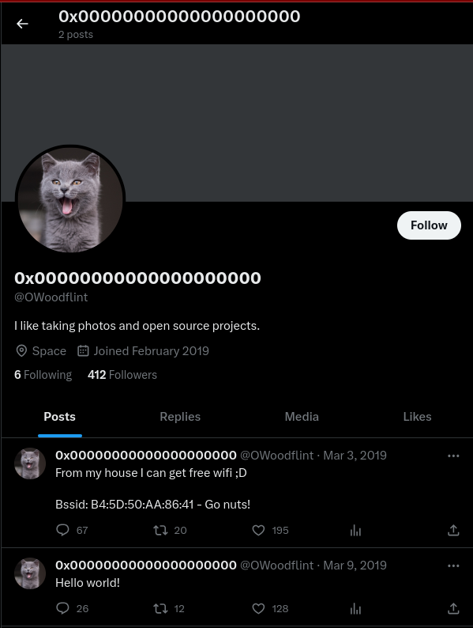

# OhSINT

Essa room tem o objetivo de obtenção de informações a partir da imagem abaixo: 

## Information Gaethering

Foi utilizada a ferramenta `exiftool` para análise do metadados da imagem. 
O nome **OWoodflint** foi encontrado no campo *Copyright*.  
Ao realizar pesquisa na web, foi encontrada uma conta na rede social Twitter com o usuário em questão. 

___

Twitter: [Link](https://twitter.com/OWoodflint)

A partir desta conta, podemos completar a primeira flag da room: 

*What is this user's avatar of?*  
RSP: **Cat**

Ao analisar as postagens da conta em questão, obtem-se um BSSID supostamente da rede privada do alvo.  

Foi utilizada a ferramenta online [Wigle](https://wigle.net/) para identificação da localização do MAC encontrado e do SSID da rede.

*What city is this person in?* 
RSP: **london** 

*What is the SSID of the WAP he connected to?* 
RSP: **UnileverWiFi** 

___

Após coletadas informações úteis no twitter, continuando as pesquisas, foi possível encontrar um GitHub em nome do alvo e um blog em wordpress. 

**GitHub:** [Link](https://github.com/OWoodfl1nt/people_finder) 

No GitHub foi possível identificar um gmail do alvo. 

*What is his personal email address?* 
RSP: **OWoodflint@gmail.com** 

No blog wordpress foi possível identificar outra localização para o alvo. 
*Where has he gone on holiday?* 
RSP: **New York**

Ainda no blog, é possível identificar uma possível senha escondida no source code do site. 
*What is the person's password?* 
RSP: **pennYDr0pper.!**

